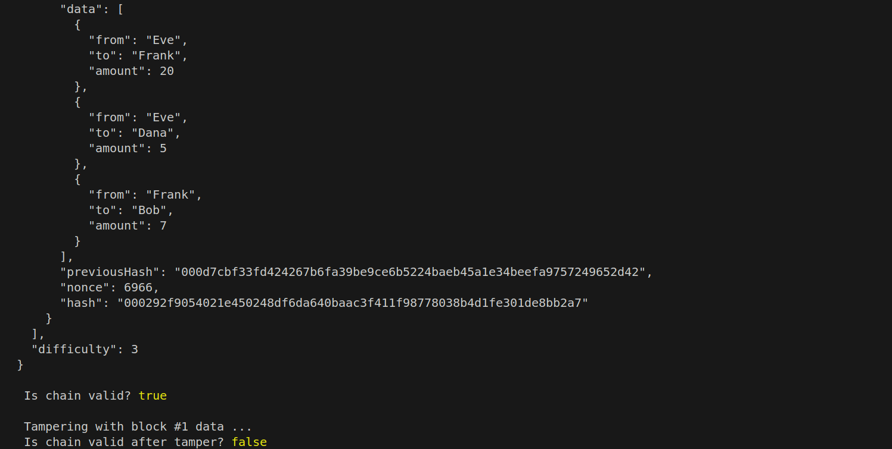

## Requirements

- Node.js (v20+ recommended)
- nmp (v10+ recommended)

## Set Up 

1. Clone or download this repository.
2. Open a terminal and navigate to the project folder:
3. bash -> cd path/to/project

## Run the program
- node blockchain.js 

## Screenshots 

## Reflection 
When I was working on this I began to understand the how hashing and immutable data are core fucntions of blockchain. The hash for each block tracks the block's index, timestamp, data, pervious hah and the nonce. Altering the data like I did broke the integrity of the block. This made me realize how hashing enfores consistent and immutable data for each block. Proof of acts like a security measure during the mining phase. The miner has to get a has with perdetermined zeros and that number is determnined by how many tires it takes to get the hash. It provides a security benfit since it would prove difficult for an attacker to figure out the hash of a block and come up with the proof of work for not only that block but for the pervious blocks as well. What suprised me was how by just tampering with a value invalidated the whole chain. I knew the sensitivity of the hash function but I did not expect this level of sensitivity. But it is also because of this that we get increased security. This taught me how blockchain maintians immutability through hashing and security through Proof-of-Work.

